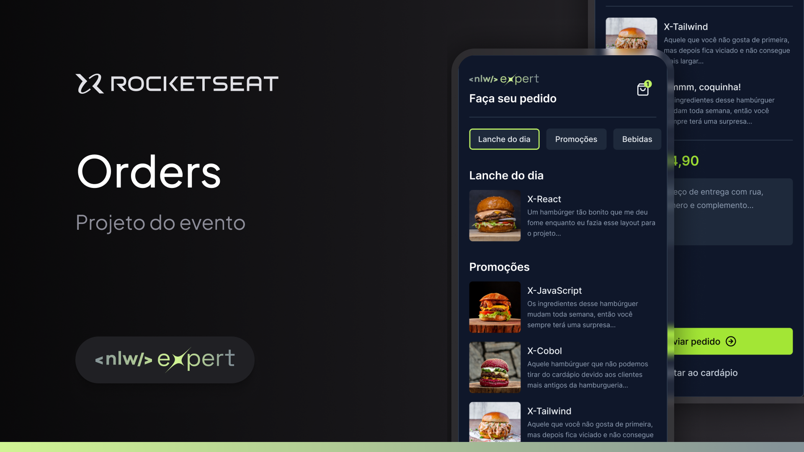

# NLW Expert Order App



## About the project

This project is part of the [NLW](https://nwl.rocketseat.com.br/) program by Rocketseat.

The goal of this project is to create an order application using React Native, Zustand, Whatsapp API, and Nativewind.

### Built With

[![Expo][Expo]][Expo-url]

[![React-Native][React-Native]][React-Native-url]

[![Nativewind][Nativewind]][Native-Wind-url]

[![Whatsapp][Whatsapp]][Whatsapp-url]

## Getting Started

Follow the steps below to run the project.

### Prerequisites

To run this project, you will need:

* npm

  ```sh
  npm install npm@latest -g
  ```

### Installation


1. Clone the repo
 ```sh
git clone https://github.com/EdlanioJ/nlw-expert-rn.git
```

2. Install NPM packages
```sh
npm install
```

### Run

Run in [Expo Go](https://expo.dev/go)

```js
npx expo start
```

Run in a Emulator

```ts
// iOS Emulator
npx expo run:ios

// Android Emulator
npx expo run:android

```

## Layout

You may view the layout of this project through this [link :link:](https://www.figma.com/file/aOd8r1Pw5Zm4KH9kZ8dLVQ/NLW-expert-%E2%80%A2-Orders-(Community)?type=design&node-id=2104-673&mode=design&t=Kkj8P3rNYDSoL18l-0). You must have an account at [Figma](https://figma.com) to access it.

## License

This project is under the MIT license. See the [LICENSE](LICENSE) file for more details.
<br/>

Made with :heart: por [Edlâneo Manuel](https://github.com/EdlanioJ) :wave:


[React-Native]: https://img.shields.io/badge/React%20Native-61DAFB?style=for-the-badge&logo=react&logoColor=ffffff
[React-Native-url]: https://reactnative.dev/

[Expo]: https://img.shields.io/badge/Expo-000000?style=for-the-badge&logo=expo&logoColor=ffffff
[Expo-url]: https://expo.io/

[React-Query]: https://img.shields.io/badge/React_Query-ef4842?style=for-the-badge&logo=tanstack&logoColor=ffffff
[React-Query-url]: https://tanstack.com/query

[Nativewind]: https://img.shields.io/badge/Nativewind-20232A?style=for-the-badge&logo=tailwind-css&logoColor=ffffff
[Native-Wind-url]: https://www.nativewind.dev/

[Whatsapp]: https://img.shields.io/badge/Whatsapp_API-25D361?style=for-the-badge&logo=whatsapp&logoColor=ffffff

[Whatsapp-url]: https://www.whatsapp.com/